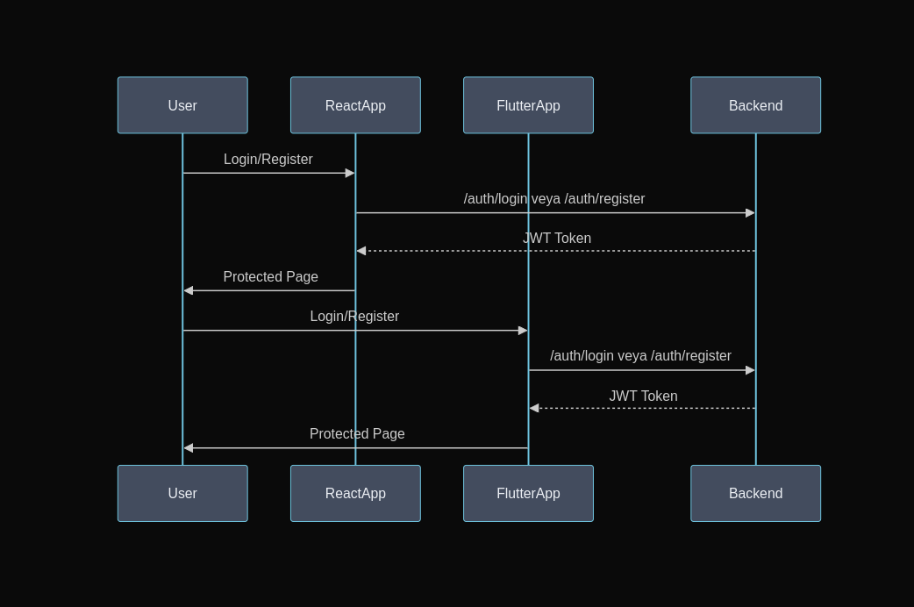
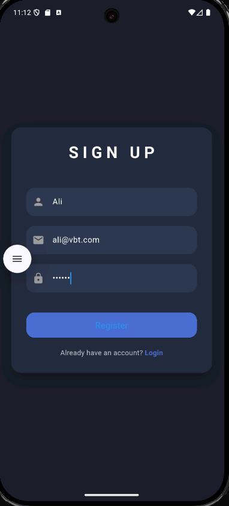
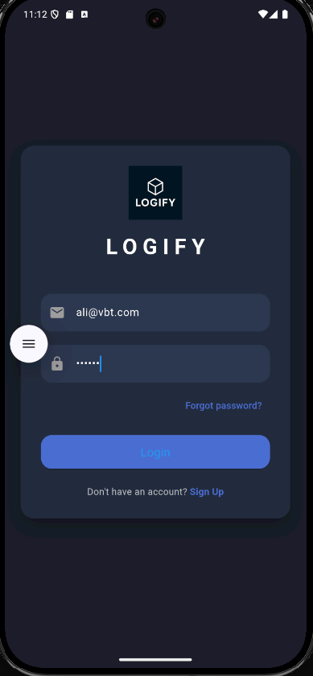
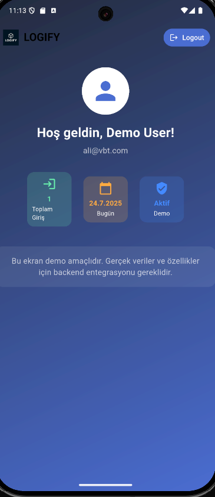
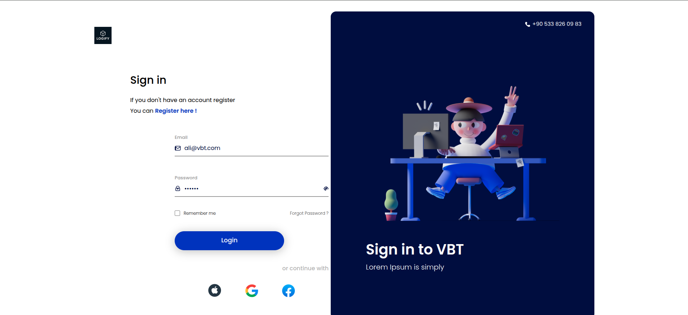
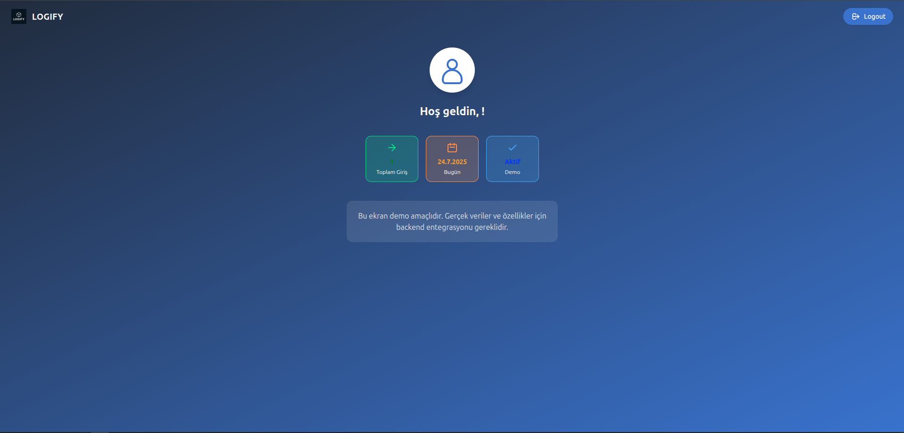

# Proje Adı: Login Uygulaması

Bu proje, kullanıcı kaydı ve girişi için modern, çok katmanlı bir uygulama sunar. Web (React), mobil (Flutter) ve backend (ASP.NET Core) teknolojileriyle geliştirilmiştir. Kullanıcılar hem web hem de mobil arayüzlerden kayıt olabilir, giriş yapabilir ve JWT tabanlı kimlik doğrulama ile güvenli bir şekilde oturum açabilirler.

Projenin mimarisine ait diyagrama aşağıdaki görselden ulaşabilirsiniz:



---

## Kullanılan Teknolojiler

- **Frontend:** React, Vite, Tailwind CSS, Axios  
- **Backend:** ASP.NET Core (.NET 8), Entity Framework Core, SQLite, JWT  
- **Mobil:** Flutter, Provider, Shared Preferences, HTTP


---

## Proje Yapısı

```
VBT_FULLSTACK/
├── assset/                # Proje görselleri
├── backend/
│   └── AuthApi/           # ASP.NET Core backend API
│       ├── Controllers/   # API controller dosyaları
│       ├── Data/          # Veritabanı context ve migration dosyaları
│       ├── Models/        # Veri modelleri
│       └── ...
├── frontend/              # React tabanlı web arayüzü
│   ├── src/
│   │   ├── components/    # React bileşenleri
│   │   ├── context/       # Context API dosyaları
│   │   ├── page/          # Sayfa bileşenleri
│   │   └── services/      # API servisleri
│   └── ...
├── mobil/                 # Flutter tabanlı mobil uygulama
│   ├── lib/
│   │   ├── models/        # Veri modelleri
│   │   ├── providers/     # State management
│   │   ├── screens/       # Ekranlar
│   │   ├── services/      # API servisleri
│   │   └── widgets/       # Özel widgetlar
│   └── ...
└── README.md              # Proje dokümantasyonu
```


---

## Kurulum ve Çalıştırma

Projeyi kendi bilgisayarınızda çalıştırmak için aşağıdaki adımları takip edin:

### 1. Repoyu Klonlayın

```bash
git clone [REPO_URL]
cd VBT_FULLSTACK
```

### 2. Backend (API) Kurulumu

```bash
cd backend/AuthApi
dotnet restore
dotnet ef database update   # Veritabanı migrasyonları
dotnet run
```

> API varsayılan olarak `https://localhost:5001` veya `http://localhost:5000` adresinde çalışır.

### 3. Frontend (Web) Kurulumu

```bash
cd frontend
npm install
npm run dev
```

Gerekirse `frontend/.env` dosyasına aşağıdaki satırı ekleyin:

```env
VITE_API_URL=http://localhost:5000/auth
```

### 4. Mobil (Flutter) Kurulumu

```bash
cd mobil
flutter clean
flutter pub get
flutter run
```

> Android emülatör veya gerçek cihazda çalıştırabilirsiniz.

---

## Kısa Açıklama

- **Web Arayüzü:** Modern ve responsive bir kullanıcı arayüzü ile kayıt ve giriş işlemleri  
- **Backend API:** JWT tabanlı kimlik doğrulama, kullanıcı yönetimi ve SQLite veritabanı  
- **Mobil Uygulama:** Flutter ile geliştirilmiş, aynı API ile entegre çalışan mobil istemci  

---

## API Temel Endpoint'leri

- `POST /auth/register` → Yeni kullanıcı kaydı  
- `POST /auth/login` → Kullanıcı girişi ve token üretimi  

---

## Ekran Görüntüleri

### Mobil

| Sign Up | Login | Home |
|--------|-------|------|
|  |  |  |

### Web

| Sign Up | Login | Home |
|--------|-------|------|
|  |  |  |

---

## Katkıda Bulunanlar
  **Grup 6**
- **Buğra Çetinkaya** – Mobil(Flutter) Geliştirici  
  **Mustafa Derya** – Mobil(Flutter) Geliştirici 
- **Doruk Yücebaşoğlu** – Backend Geliştirici
  **Ayça Işık** – Backend Geliştirici    
- **Elif Barlık** – Frontend (React/Angular) Geliştirici
  **Emir Taylan Günday** – Frontend (React/Angular) Geliştirici
---

## Lisans

Bu proje yalnızca eğitim amaçlıdır. Kodlar açık kaynak değildir ve izinsiz kopyalanamaz.
